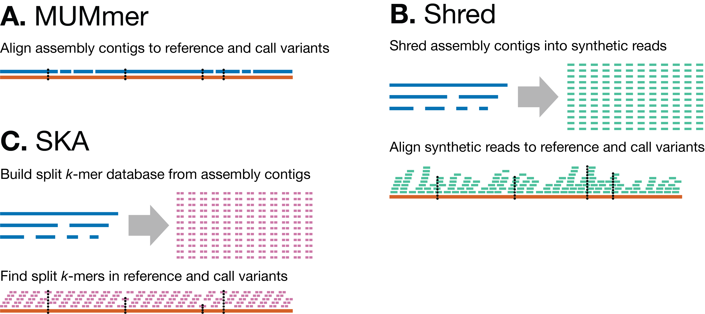

**Figure 1:** Methods for calling variants from assemblies. **A:** The MUMmer method relies on directly aligning the assembly’s contigs to the reference genome, with variants called from these alignments. **B:** The Shred method produces synthetic error-free reads from the assembly’s contigs and aligns them to the reference genome, allowing for the use of read-based variant callers such as Freebayes. **C:** The SKA method uses split k-mers to efficiently find SNPs between the assembly’s contigs and reference genome.

    

**Figure 2:** The relationship between the seven _S. aureus_ NRS384 isolates used in this study. **A:** an invariant-free multiple sequence alignment, showing all variants between the isolates and the wild-type (WT) reference: 23 SNPs (green) and 2 indels (pink). **B:** the phylogenetic relationship between the isolates, as constructed by IQ-TREE v2.3.6 (using the `--polytomy` option and rooted on the WT reference).

    

**Figure 3:** Variant-calling errors for both read-based and assembly-based variant-calling methods. For each method, the errors were summed across all genomes and read depths. See Figure S2 for the results for each depth separately and for sensitivity and precision values. The y-axes have a pseudo-log transformation.

    

**Figure S1:** Phenotypic characterisation of the isolates. SBA = Sheep blood agar (5% sheep blood in Columbia agar); shows haemolytic activity. MLA = Micrococcus luteus agar (BHI agar containing 0.2% _Micrococcus luteus_ cells [Sigma-Aldrich, M3770]); shows the secretion/activity of one WalR-regulated peptidoglycan hydrolase (Atl). MHA = Mueller-Hinton agar (Difco); shows the colour of the cells. IMAL058 is a SigB mutant, making it more yellow than the other isolates.

    

**Figure S2:** Variant calling metrics for both read- and assembly-based variant calling methods at each read depth. False negative and false positive errors are shown in the plots. Sensitivity (sens) and precision (prec) are shown above the plots. The y-axes have a pseudo-log transformation.

    

**Figure S3:** Variant-calling errors, before and after Medaka polishing, for each of the long-read assembly methods. Assemblies with missing sequence (particularly the 4.4 kbp plasmid) or duplicated sequence (e.g. start-end overlap of circular contigs) were prone to acquiring errors during Medaka polishing, leading to post-Medaka assemblies having more total errors than pre-Medaka assemblies. See Table S3 and [rrwick.github.io/2024/10/17/medaka-v2.html](https://rrwick.github.io/2024/10/17/medaka-v2.html) for more information.
